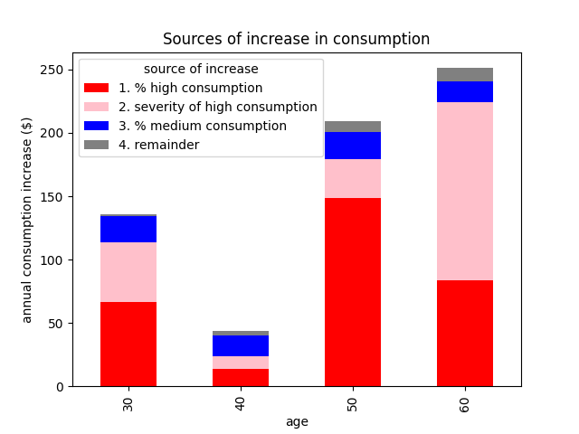
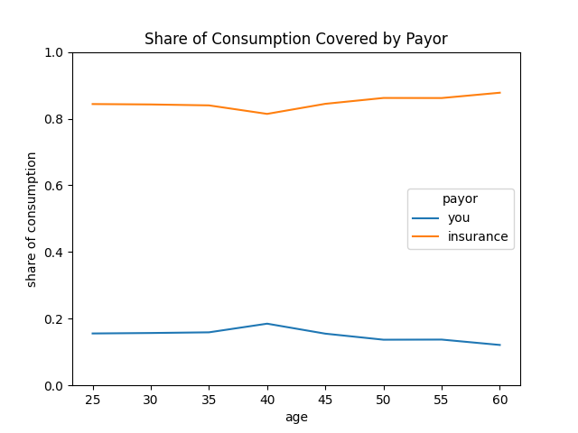

# How will my medical costs change as I age?

# Summary
With age, people tend to require more healthcare.  More healthcare means larger medical bills that someone will have to pay.  Though many folks will still require few healthcare services even into their late 50s, the likelihood of developing a medical condition and the cost of the associated treatments increases with age. Most of this additional expense is covered by insurance companies (~85%), but insurance companies know this and charge for it up-front through a by increasing premiums with age. With higher premiums, greater out-of-pocket spending, and medical inflation, you can expect medical spending to grow by roughly ~9% each year as you age. To keep these costs down though, it's important to stay healthy and shop around each year for the best true cost insurance plan.

# Introduction

In order to plan financially for the future it's important to have a sense of how your expenses will evolve.  For most spending categories - like groceries, rent, or transportation - the spend amount is fairly stable, with a small increase each year due to inflation.  

Healthcare is much more difficult.  This is so for a few reasons:
- **The amount you spend can vary a lot from one year to the next.**  If you are relatively healthy, you'll have very few out of pocket expenses most years. But on the off-chance that a medical issue arises, costs could be much more than you are used to.
- **Health insurance premiums increase with age.**  Age is one of the few variables that marketplace plans use to determine your monthly premium.  So just by virtue of getting older, your monthly premium will go up by about 3% each year.
- **The cost of medical care increases over time.**  Inflation increases the cost of most goods and services over time, but in the US, the cost of medical care has generally increased more quickly than the standard basket of goods.

So let's dig into it.

# Medical Expenses Increase with Age.

On average, older folks consume more healthcare than younger folks.  This is very clear in the figure below, where we measure healthcare consumption in terms of the dollar value of services received.

It's important to recognize that this average dollar amount is very different from what most folks in each age group experience.  The average is pulled up by a small handful of folks with very high spending.  Most people have much lower expenditures - notice how the median expenditure is significantly lower than the average.

This should be no surprise. Risk of medical spending is a textbook application of insurance, where the contributions of the many - with little to no losses - help offset the expenses of the few who experience severe losses.

So why does healthcare spending increase with age?  We can divide the driving forces into two:
1. the likelihood that an individual requires healthcare services
2. the nature of the medical conditions that arise and how expensive the associated services are.

In the figure below we see that the fraction of folks with low consumption (less than $1k annually) decreases with age, while the fraction of folks with medium ($1k - $10k), and high consumption ($10k+) increases.  In other words, as you age you are more likely to develop a serious medical condition. However, note that even at 60 years of age a large share of the population still has low consumption.

When we quantify the role of each factor, we find that most of the increase in average expenditures can be attributed to the growing share of individuals with high consumption and the increased severity of a high consumption year.  In other words, as you age you are more likely to develop a serious medical condition, and those medical conditions get more expensive as you age.  The baseline spending of healthy folks is only a minor part of this increase.

To determine this, we gradually adjust the population characteristics towards that of the next age bucket and see how much of the increase in mean expenditure is explained by doing so.  You can see the results in the figure below.

# Who pays for this increase in cost?
In short, you do.  But let's look at what's going on a bit more closely.

When you have insurance, your plan helps you pay for the cost of healthcare.  As shown in the figure below, both the amount paid by consumers out-of-pocket and the amount paid by the insurance companies increases with age, but the bulk of the increase is absorbed by the insurance company.

Another way to look at this is in terms of the share of total expenditures paid by each party.  This is relatively stable across age groups, with the insurance company footing the bill for roughly 85% of expenditures for all age groups.

Your particular share of expenses that can look quite different from this, though.  It is a function both of what plan you choose, and how much your medical expenditures are.  Major medical insurance plans are designed to protect customers primarily from tail risk - i.e. having a year with very high total expenditure - and so tend to cover a larger share of expenditures for customers with high consumption.  The flip side of this is that customers bear a larger share of the cost when expenditures are low.  This plays out at all age groups.

So the insurer picks up most of the additional bills, sounds great right?  Not so fast!  

Remember that health insurance is not a charity, they need to stay solvent.  The money that the insurer pays to help cover your bills ultimately comes from your very own monthly premiums.  And because medical expenditures increase so strongly with age, insurance companies charge a higher premium as you age.

In fact, the increase in premium with age follows a shape that closely resembles the way in which the average payout increases with age. In other words, insurance companies know that older folks tend to have higher medical expenses, and they charge up-front for that!

# Medical inflation
The last piece of the puzzle is how the cost of medical services will grow.  It's to be expected that the price of most goods and services increases over time.  But in the US, the cost of medical expenses has generally outpaced inflation on the standard basket of goods.  Recently, medical inflation has been about 4%, but it is likely to go higher and catch up with overall inflation.

# Putting it all together

First of all, it's important to recognize that if you have been in relatively good health, you should not plan your financial future assuming that your out-of-pocket expenses will stay the same.  You should have the financial footing to handle a worst case scenario. To understand this, consider the out-of-pocket maximum for your plan.  When you shop with Lumos Health, you can also see how likely you are to have high out-of-pocket spending under your chosen plan, according to our data.

That being said, we can still talk about the average case to prepare for, and how those costs will increase each year.  Both premiums and medical expenses tend to increase by ~3% with each year of age. And in the near future, a 6% rate of inflation in medical expenses seems likely, which we will apply to both premiums and out-of-pocket expenses.  With this, we calculate an expected annual rate of increase in total healthcare expenses of about 9.2%. When inflation subsides, this figure will be much lower.

A 9.2% annual increase is quite an intimidating number, but there are still things that you can do to help keep your costs down.
1. **Stay healthy.** Eat well, exercise regularly, maintain an appropriate body weight, and stay on top of your preventive care.  All of these decrease the likelihood that you will need expensive medical care, keep your out-of-pocket costs low, and give you the room to enroll in a more economic plan that works well for folks in good health.
2. **Evaluate your plan options each year.**  There is a wide variety in the premiums and level of coverage offered by marketplace plans.  Finding the best true cost plan - considering both premiums and out of pocket costs - can save you hundreds of dollars each year.  Shop with Lumos Health to find the best true cost plan in under 10 minutes.

With this information, you should have much more clarity on how your medical expenses will evolve over time, as well as what you can do to keep these costs down.

## About the analysis.

Data on medical expenditures comes from MEPS, and the population is limited only to folks that have private insurance and who receive no help towards their medical bills outside of their private insurance coverage.

Information on insurance premiums comes from CMS.  To get a value representative of the annual premium of a health plan for a consumer of a given age, we process the data in the following way.
1. The data provided contains the premium for all plans offered on the healthcare marketplace.
2. We keep only plans that are in the most populous states that together make up 50% of the total population in states that use the federal healthcare marketplace.
3. Find the median annual premium by age.

This method does not consider the amount of people under each plan.  For this reason, the exact dollar value should not be compared directly with medical expenses.  However, we do believe that this is a reasonable way to look at how premiums increase with age.

You can find the reproducible analysis in this [GitHub repository](https://github.com/ttbon/healthspend_by_age).

Finally, we note that the events that lead to high medical expenses are not equally likely to happen to anyone.  In other words, this analysis is based on the population average, and the specifics of your situation will give you good reason to expect your experience to be different from the average in one way or another.

Your individual health plays a strong role in terms of what risks you face, as do genetic makeup, sex, occupation, and lifestyle choices.  Incentives can also play a role.  For folks with a generous health insurance plan through their company, healthcare consumption is greatly subsidized and so they are likely to consume much more healthcare than if they had to pay for most of it out of pocket.  Attitudes towards healthcare and death can also play a large role in the increased cost of healthcare with age.  We saw earlier that most of the increase in cost is due to a greater share of folks with high consumption.  Due to advances in modern medicine, there is almost always something to be done when a patient is facing a serious medical condition.  Under such worst case scenarios, a consumer is very likely to have hit their out-of-pocket maximum already.  Under such a situation, some consumers will want to do all that can be done to keep the patient alive, this behavior tends to be expensive, but it can be done because the insurance is footing the bill.  Some folks will instead choose to value quality of life in the final years under such a situation and decline potentially life saving care - the associated medical cost would be much less.

Caveats aside, we feel that this analysis will serve as a useful guide to the consumer to understand why medical costs will increase with age, how much of an increase to expect, and what can be done to manage it.
